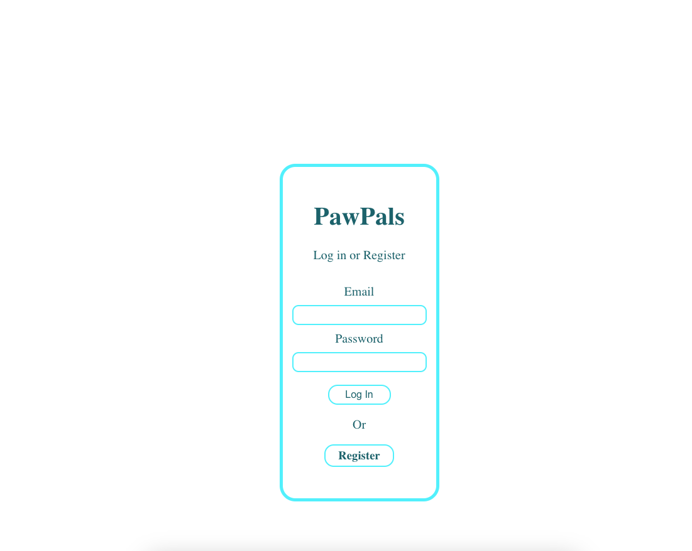
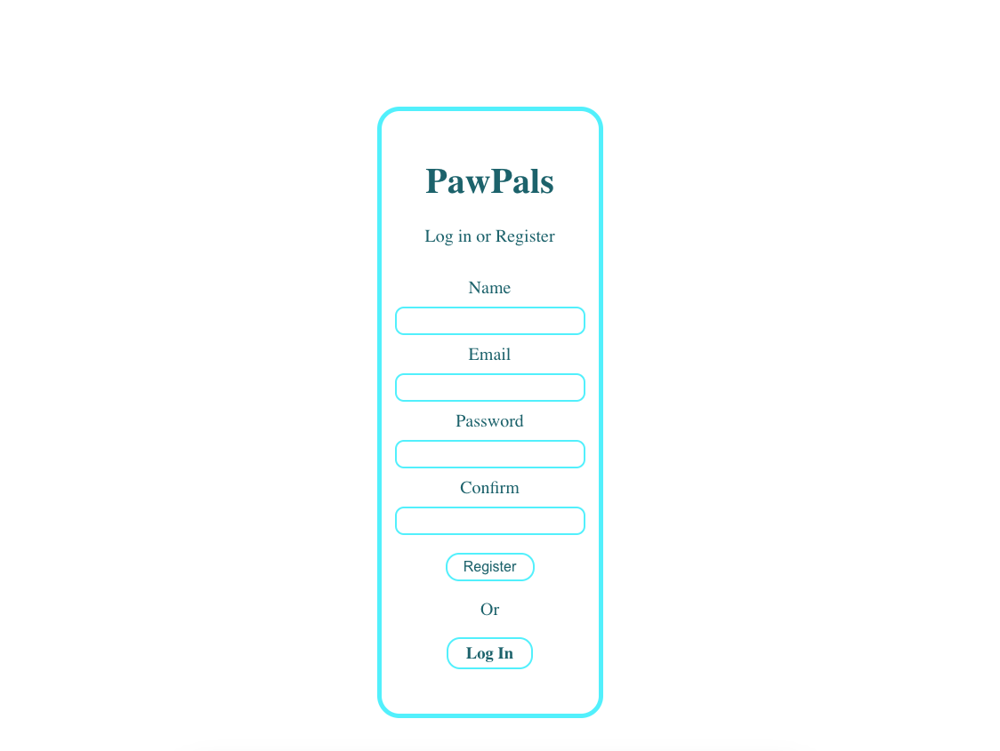
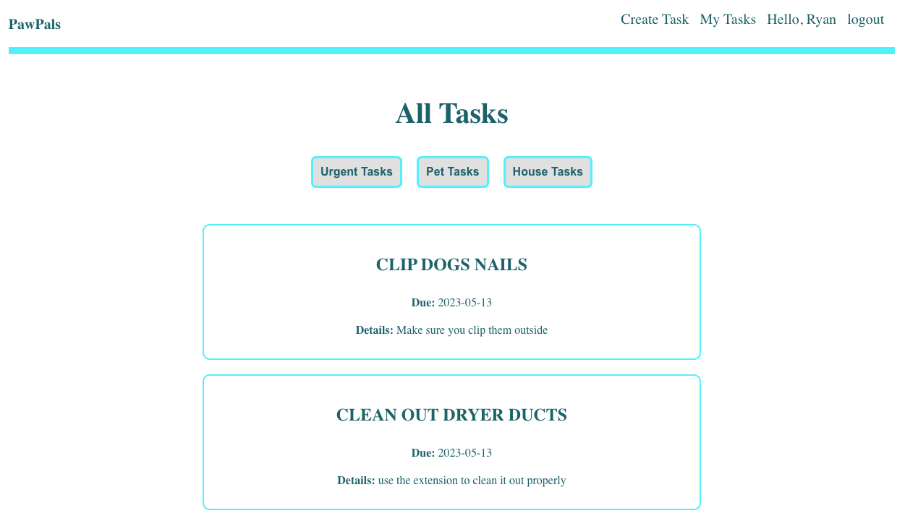
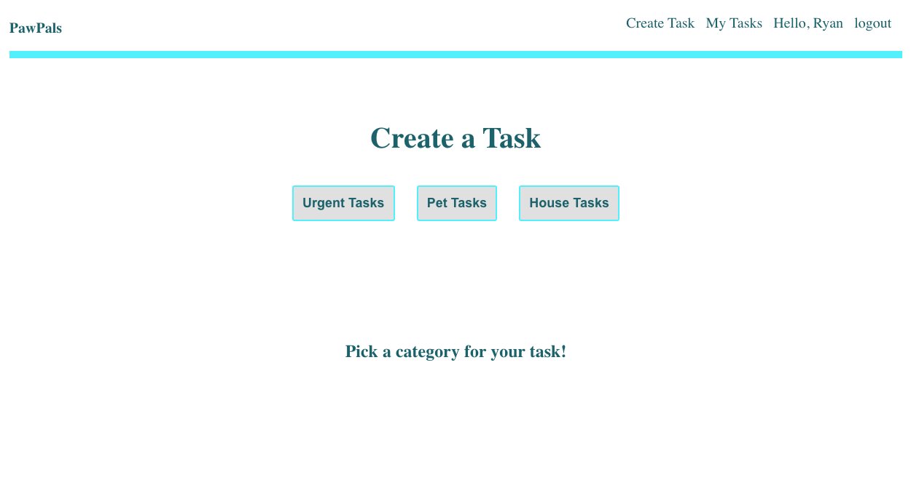
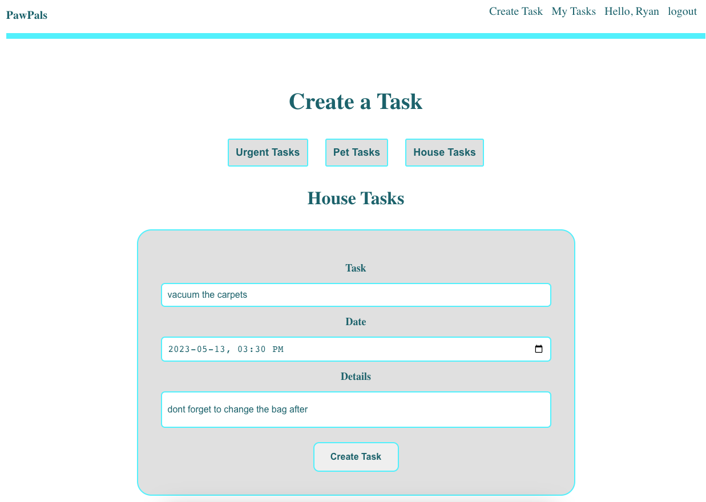
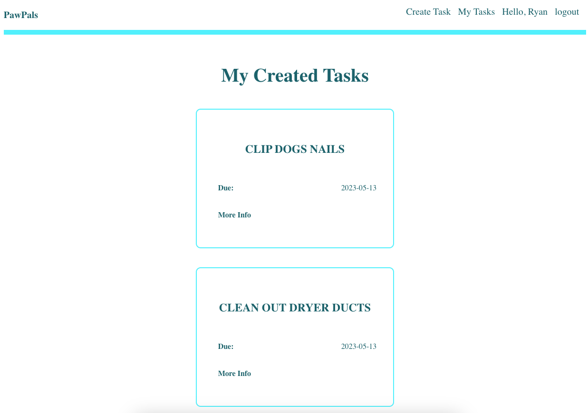

# PawPals

PawPals is a task-based app that helps users stay on top of their household, pet, and urgent tasks. By separating tasks into different categories, users can stay organized with everything that needs to be done with the ability to prioritize certain tasks. 

### [Lets Get Started - PawPals](https://pawpals-57.herokuapp.com/)

### [Trello Board](https://trello.com/b/eMuiQD7j/project-4-pawpals)

 

## Technologies Used

<li> HTML, CSS, JS
<li> MongoDB
<li> Mongoose
<li> Express
<li> React
<li> Node.js
<li> Heroku
<li> Atlas DB

 

## Screenshots

 
Login
 

 
Register Screen

 
All Tasks

 
Create a Task

 
Create Task Form

 
My Tasks

 

## Icebox Items
<li> Have the ability to create your own categories --> have more than the 3 standard options
<li> Be able to re-assign a task to a different category after its been created
<li> More field options that aren't required --> photo inclusivity
